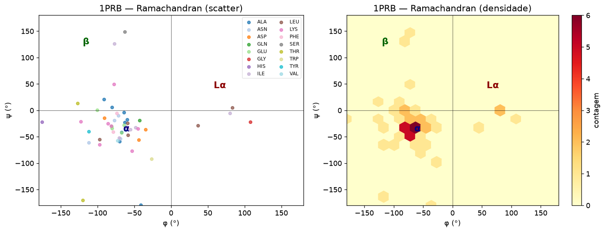
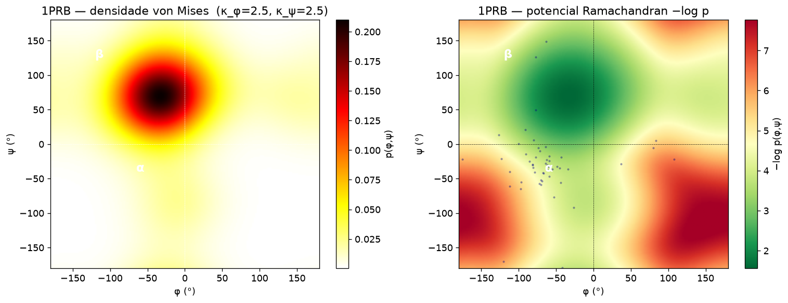

# Protein Periodicity — Statistical Potential Pipeline

Extraction of backbone and side-chain dihedral angle distributions from PDB crystal structures, fitted as 2D von Mises statistical potentials for use as internal forces in rigid-body protein dynamics simulations.

This is a project on packing charged multibody systems with implicit solvation. Proteins are modelled as charged multibody systems; the pipeline extracts statistical data from large samples of crystal structures selected from the PDB and produces two types of libraries for multibody dynamics: a library of statistical potentials for pairs of dihedral angles in the main-chain local conformation, and a rotamer library. Both are defined as sets of discrete probability distributions and used to generate internal forces on multibody systems.

Live site with per-amino-acid results: <http://melroleandro.github.io/Protein-periodicity/>

## Repository layout

```
protein-periodicity-pipeline/
├── data/
│   ├── pdb1A.tsv          # 607 curated PDB IDs (primary reference set)
│   └── pdb1AB.tsv         # Extended PDB ID list
├── docs/
│   ├── Fluxo_Prot2.pdf    # Pipeline flow diagram
│   └── posts/             # Per-amino-acid statistical reports (20 AAs)
│       ├── 2015-04-03-Amino-ALA.markdown
│       ├── ...
│       ├── 2015-05-01-Von-Mises.markdown
│       ├── 2015-05-02-circular-statistics.markdown
│       ├── 2015-05-02-Used-Protein.markdown
│       ├── 2015-06-20-Protein-local-propensit.markdown
│       └── 2015-06-30-description.markdown
├── matlab/                # Original MATLAB pipeline
│   ├── CircStat/          # Circular statistics toolbox (Berens 2009)
│   ├── pdbTools/          # PDB geometry utilities
│   ├── ExtractPDBinfo.m   # Download and filter PDB structures
│   ├── Protein.m          # Extract dihedral angles → aminoData/*.cvs
│   ├── ForcesCont.m       # Compute 2D von Mises potentials
│   ├── MainAnalysis.m     # Top-level entry point
│   └── Analysis.m         # Full statistics + figure generation
└── python/                # Python port
    ├── protein_periodicity/
    │   ├── pdb_tools.py   # Backbone geometry (dihedral angles, bond lengths)
    │   ├── circ_stat.py   # Circular statistics (port of CircStat toolbox)
    │   ├── extractor.py   # PDB → aminoData/*.csv  (port of Protein.m)
    │   └── analysis.py    # CSV → contData/*.npz   (port of ForcesCont.m)
    ├── notebooks/
    │   ├── 01_pdb_tools.ipynb         # Full walkthrough and validation
    │   └── 02_amino_analysis.ipynb    # Per-amino-acid statistical analysis (change AMINO = "...")
    ├── run_pipeline.py    # End-to-end pipeline script
    └── requirements.txt
```

## Notebooks

| Notebook | Description |
|----------|-------------|
| [`01_pdb_tools.ipynb`](python/notebooks/01_pdb_tools.ipynb) | Full walkthrough of `pdb_tools.py`: dihedral extraction, bond geometry, single-structure analysis |
| [`02_amino_analysis.ipynb`](python/notebooks/02_amino_analysis.ipynb) | Per-amino-acid statistical report (change `AMINO = "TYR"` to any of the 20 standard amino acids). Covers B-factor & bond geometry, φ/ψ/χ circular statistics, uniformity tests, measures of association, Ramachandran plot, and all statistical potential maps |

## Documentation

- **[`docs/technical_report.md`](docs/technical_report.md)** — full technical report: theoretical background (von Mises KDE, statistical potentials, circular statistics), methodology, results, discussion, and complete Python API reference (Appendix A)
- **[`docs/Fluxo_Prot2.pdf`](docs/Fluxo_Prot2.pdf)** — original MATLAB pipeline flow diagram
- **[`docs/Python_Pipeline.pdf`](docs/Python_Pipeline.pdf)** — Python port flow diagram: `extractor.py` and `analysis.py` + `circ_stat.py`, with formulas and I/O specs
- **[`docs/posts/`](docs/posts/)** — per-amino-acid statistical reports with sample sizes, descriptive circular statistics (φ, ψ, χ₁–χ₄), uniformity tests (Rayleigh, Omnibus, Rao, V-test), circular correlations, and potential map images. One file per amino acid plus five thematic posts:
  - [`Von-Mises.markdown`](docs/posts/2015-05-01-Von-Mises.markdown) — von Mises distribution background
  - [`circular-statistics.markdown`](docs/posts/2015-05-02-circular-statistics.markdown) — circular statistics methods
  - [`Used-Protein.markdown`](docs/posts/2015-05-02-Used-Protein.markdown) — PDB structures used in the analysis
  - [`Protein-local-propensit.markdown`](docs/posts/2015-06-20-Protein-local-propensit.markdown) — local propensity analysis
  - [`description.markdown`](docs/posts/2015-06-30-description.markdown) — project description

## Quick start (Python)

```bash
cd python/
pip install -r requirements.txt

# Run the full pipeline (downloads ~600 PDB files on first run)
python run_pipeline.py

# Limit to N structures for testing
python run_pipeline.py --max-pdbs 10

# Change angular resolution (default 180 → 2° per cell)
python run_pipeline.py --n-ang 360
```

Outputs written to `python/aminoData/` (CSV) and `python/contData/` (`.npz` potential maps).

## MATLAB pipeline

```matlab
% From MATLAB, with ToolsSrc/ on the path:
ExtractPDBinfo    % populate proteins.txt from pdb1A.tsv
MainAnalysis      % run ForcesCont for all 20 amino acids
```

## Pipeline stages

| Stage | Input | Output | Module |
|-------|-------|--------|--------|
| Extraction | `data/pdb1A.tsv` | `aminoData/<AA>.csv` | `extractor.py` / `Protein.m` |
| Potential maps | `aminoData/<AA>.csv` | `contData/Mises<AA>180.npz` | `analysis.py` / `ForcesCont.m` |

Each `.npz` file contains, for every dihedral pair (φ–ψ, φ–χ₁, ψ–χ₁, χ₁–χ₂, …):
- `E_k` — statistical potential (−log p), shape (180, 180)
- `Gx_k`, `Gy_k` — gradient components (generalised forces)
- `kappa_k` — von Mises concentration parameters [κ₁, κ₂]
- `n_k` — sample count used

## Python package API

```python
from protein_periodicity.extractor import extract_from_file
from protein_periodicity.analysis  import load_potential, analyse_all

# Load a precomputed potential
data = load_potential("python/contData", "ALA", n_ang=180)
E    = data["potentials"][0]["E"]   # shape (180, 180)
Gx   = data["potentials"][0]["Gx"]
Gy   = data["potentials"][0]["Gy"]
```

## Example output (1PRB — Protein B of the bacteriophage 434 repressor)

<p align="center">
  
  &nbsp;
  
</p>
<p align="center">
  <em>Left: Ramachandran scatter plot (φ vs ψ) for all residues in PDB structure 1PRB, coloured by amino acid type.
  Right: φ–ψ statistical potential (−log p) derived from von Mises KDE on the full 607-structure reference set,
  with the 1PRB residues overlaid; darker regions indicate lower free energy (higher probability).</em>
</p>

## Results (607 PDB structures, pdb1A reference set)

| Amino acid | Residues | Potentials |
|-----------|---------|-----------|
| GLY | 9,695 | φ–ψ |
| ALA | 9,618 | φ–ψ |
| LEU | 8,052 | φ–ψ, φ–χ₁, ψ–χ₁, χ₁–χ₂ |
| ARG | 4,211 | φ–ψ, φ–χ₁, ψ–χ₁, χ₁–χ₂, χ₂–χ₃, χ₃–χ₄ |
| … | … | … |
| **Total** | **~105,000** | **72 maps (20 AAs × up to 6 pairs)** |
