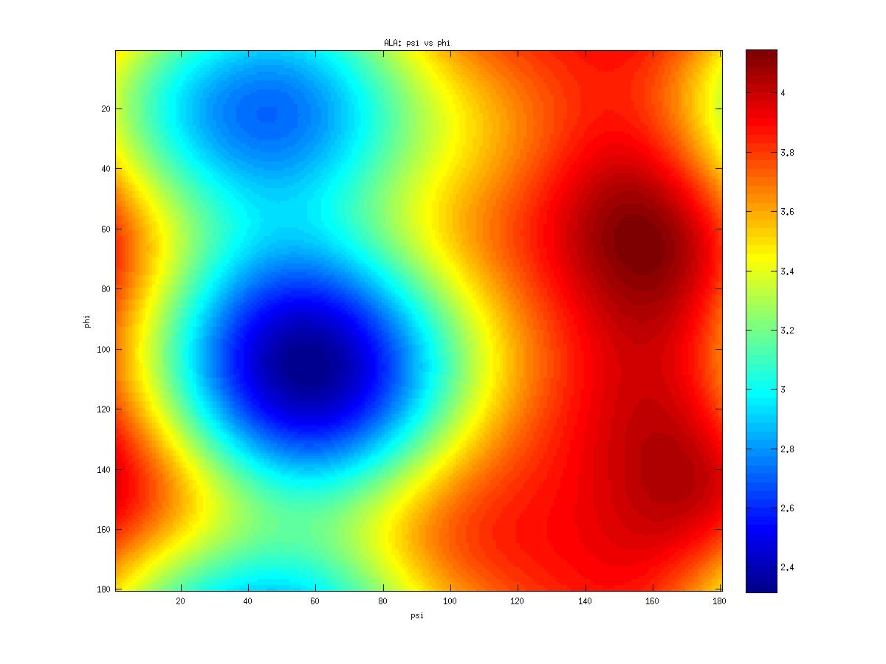

# von Mises-Fisher distribution

Circular distributions are important in modeling angular variables in biology, astronomy, meteorology, earth sciences and several other areas. In molecular sciences have been used for modeling torsional angles in molecules.

The von Mises-Fisher distribution distribution is a continuous probability distribution on the circle used in directional statistics. The von Mises distribution is used  to model angles and other circularly distributed  variables. It approximates  the  normal  distribution,  but  has  the advantage that it is mathematically more tractable.  Additionally, the von Mises distribution can be generalized to distributions over the $$(p-1)$$-dimensional sphere in $$\mathbb{R}^p$$, where it is known as the von Mises-Fisher distribution.

The probability density function of the van Mises Distribution for the random $$p$$-dimension unit vector $$\phi$$ is given by:

$$f(\phi)=\frac{\kappa^{p/2-1}}{(2\pi)^{p/2}I_{p/2-1}(\kappa)}\exp(\kappa\mu^T\phi)$$

where $$\kappa\geq 0$$, $$\|\mu\|=1$$ and the term $$I_k$$ denotes the modified Bessel function of the first kind at order $$k$$.

Let $$\phi_1$$ and $$\phi_2$$ be two circular random variables. The probability density function takes the form:

$$f(\phi_1,\phi_2)=\frac{\exp(\kappa_1\cos(\phi_1-\mu_1)+\kappa_2\cos(\phi_2-\mu_2)+\lambda_{12}\sin(\phi_1-\mu_1)\sin(\phi_2-\mu_2))}{T(\kappa_1,\kappa_2,\lambda_{12})}$$

for $$-\pi \leq \phi_1,\phi_2 < \pi$$, where $$\kappa_1,\kappa_2 \geq 0$$, $$-\infty \leq \mu_1,\mu_2 < \pi$$, and $$T$$ is the normalizer. This probability density function is constructed from the bivariate normal distribution by replacing the quadratic and linear terms by their natural circular analogues. This distribution is approximately bivariate normal when the fluctuations in the circular variables are small.  The parameter $$\lambda_{12}$$ is a measure of dependence between $$\phi_1$$ and $$\phi_2$$. If $$\lambda=0$$, then $$\phi_1$$ and $$\phi_2$$ are independent with each having univariate von Mises distribution.

The normalizer $$T$$ has the expression

$$T(\kappa_1,\kappa_2,\lambda_{12})=4\pi^2\sum_{m=0}^{\infty}C_m^{2m}\left(\frac{\lambda}{2}\right)^{2m}\kappa_1^{-m}I_m(\kappa_1)\kappa_2^{-m}I_m(\kappa_2).$$

Below, the figure describes the von Mises-Fisher distribution for the two dihedral angles $$\phi$$ and $$\psi$$ on the main chain for the amino acid ALA (Alanine). This reflects the neighbor-dependent Ramachandran probability distributions of amino acids dihedral angles. This was computed using a grid of $$2^\circ\times 2^\circ$$ from $$-180^\circ$$ to $$180^\circ$$ in $$\phi$$ and $$\psi$$ (3933 values).  The distribution is used in our work to evaluate free energy of the system for a given configuration.

# A graphical model for the Mises-Fisher distribution

Here we review a graphical model for the Mises-Fisher distribution, proposed by N. S. Razavian, H. Kamisetty and C. J. Langmead in [0], and the algorithm for learning the structure and parameters of the model. Allowing the learn of a $$L_1$$-regularized graphical model of the form of a multivariate Von Mises distribution, such that the couplings are modeled as directional variables.
